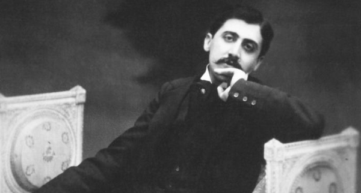
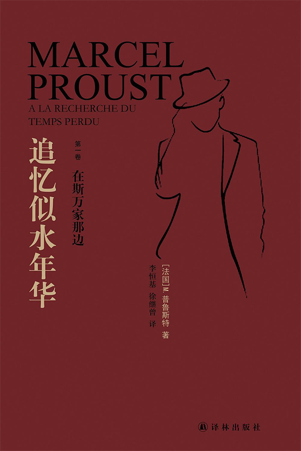
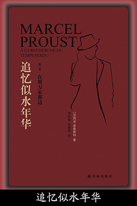

# Proust

## 夜半的太阳
> 第一主题，是时间。他的书以这个主题开端、告终。“假如假以天年，允许我完成自己的作品，我必定给它打上时间的印记：时间这个概念今天以不可抗拒的力量强迫我接受它。我要在作品里描写人们在时间中占有的地位比他们在空间中占有的微不足道的位置重要得多，即便这样做会使他们显得类似怪物……”我们周围的一切都处于永恒的流逝、销蚀过程之中，普鲁斯特无日不为这个想法困扰。“就像空间有几何学一样，时间有心理学。”人类毕生都在与时间抗争。他们本想执著地眷恋一个爱人、一位友人、某些信念；遗忘从冥冥之中慢慢升起，淹没他们最美丽、最宝贵的记忆。

> 古典哲学假定“有一种不变的信仰犹如精神的雕像形成我们的人格”，这座雕像在外部世界的冲击下坚定不动如磐石。但是普鲁斯特知道**自我在时间的流程中逐渐解体**。为期不远，总有一天那个原来爱过、痛苦过、参与过一场革命的人什么也不会留下。我们将在小说里看到斯万、奥黛特、希尔贝特、布洛克、拉谢尔、圣卢怎样逐一在感情和年龄的聚光灯下通过，呈现不同的颜色，就像舞女的白色衣裙在灯光下依次变成黄色、绿色或蓝色一样。沉溺在爱河中的自我不能想象，几年以后，同一个自我一旦从爱情中解脱出来，又会是什么样子。而且可叹的是“房屋、街衢、道路和岁月一样转瞬即逝”。我们徒然回到我们曾经喜爱的地方；**我们决不可能重睹它们，因为它们不是位于空间中，而是处在时间里，因为重游旧地的人不再是那个曾以自己的热情装点那个地方的儿童或少年**。

> 然而我们的历任自我并不完全消失，因为它们能在我们的睡梦中，甚而在清醒状态下重现。普鲁斯特在他的交响乐的第一乐章即陈述睡醒的主题，这并非事出偶然，而是有意为之。每天早晨，在片刻迷糊之后，我们重新拥有我们自身；这说明我们从未完全失去它。马塞尔在他生命的最后几年能在自己身上某处听到“小铃铛清脆的铁质铃声不时响起、无休无止、吵吵嚷嚷”，在他童年时代每次铃响总是宣告斯万来访。那必定是这个铃铛从未停止在他身上丁冬作响。因此时间看起来好像完全消逝，其实不然，它正与我们自身融为一体。由此产生了作为普鲁斯特作品的根源的想法，即追寻似乎已经失去，其实仍在那里，随时准备再生的时间。

> 这个追寻只能在人们视为“真实”的那个世界里进行。**其实这个世界是不真实的，至少是不可认识的**，因为我们看到的世界永远受到我们自身的情欲的歪曲。**世界不是一个，而是成千上万**；“每天清晨有多少双眼睛睁开，有多少人的意识苏醒过来”，便有多少个世界。因此，要紧的不是生活在这些幻觉之中并且为这些幻觉而生活，而是在我们的记忆中寻找失去的乐园，那唯一真实的乐园。“过去”便是我们每个人身上都存在的某种永恒的东西。我们在生命中某些有利时刻重新把握“过去”，便会“油然感到自己本是绝对存在的”。所以，除了第一个主题：摧毁一切的时间而外，另有与之呼应的补充主题：起保存作用的回忆。不过我们这里指的不是随便哪一种回忆；普鲁斯特的主要贡献在于他教给人们某种回忆过去的方式。

## 追忆似水年华
> 一个人睡着时，周围萦绕着时间的游丝，岁岁年年，日月星辰，有序地排列在他的身边。醒来时他本能地从中寻问，须臾间便能得知他在地球上占据了什么地点，醒来前流逝过多长的时间；但是时空的序列也可能发生混乱，甚至断裂，例如他失眠之后天亮前忽然睡意袭来，偏偏那时他正在看书，身体的姿势同平日的睡态大相径庭，他一抬手便能让太阳停止运行，甚至后退，那么，待他再醒时，他就会不知道什么钟点，只以为自己刚躺下不久。倘若他打瞌睡，例如饭后靠在扶手椅上打盹儿，那姿势同睡眠时的姿势相去更远，日月星辰的序列便完全乱了套，那把椅子就成了魔椅，带他在时空中飞速地遨游，待他睁开眼睛，会以为自己躺在别处，躺在他几个月前去过的地方。但是，我只要躺在自己的床上，又睡得很踏实，精神处于完全松弛的状态，我就会忘记自己身在何处，等我半夜梦回，我不仅忘记是在哪里睡着的，甚至在乍醒过来的那一瞬间，连自己是谁都弄不清了；当时只有最原始的一种存在感，可能一切生灵在冥冥中都萌动着这种感觉；我比穴居时代的人类更无牵挂。可是，随后，记忆像从天而降的救星，把我从虚空中解救出来：起先我倒还没有想起自己身在何处，只忆及我以前住过的地方，或是我可能在什么地方；如没有记忆助我一臂之力，我独自万万不能从冥冥中脱身；在一秒钟之间，我飞越过人类文明的十几个世纪，首先是煤油灯的模糊形象，然后是翻领衬衫的隐约的轮廓，它们逐渐一点一画地重新勾绘出我的五官特征。

> 也许，我们周围事物的静止状态，是我们的信念强加给它们的，因为我们相信这些事物就是甲乙丙丁这几样东西，而不是别的玩意儿；也许，由于我们的思想面对着事物，本身静止不动，才强行把事物也看做静止不动。然而，当我醒来的时候，我的思想拼命地活动，徒劳地企图弄清楚我睡在什么地方，那时沉沉的黑暗中，岁月、地域，以及一切、一切，都会在我的周围旋转起来。我的身子麻木得无法动弹，只能根据疲劳的情状来确定四肢的位置，从而推算出墙的方位，家具的地点，进一步了解房屋的结构，说出这皮囊安息处的名称。躯壳的记忆，两肋、膝盖和肩膀的记忆，走马灯似的在我的眼前呈现出一连串我曾经居住过的房间。肉眼看不见的四壁，随着想象中不同房间的形状，在我的周围变换着位置，像漩涡一样在黑暗中转动不止。我的思想往往在时间和形式的门槛前犹豫，还没有来得及根据各种情况核实某间房的特征，我的身体却抢先回忆起每间房里的床是什么式样的，门是在哪个方向，窗户的采光情况如何，门外有没有楼道，以及我入睡时和醒来时都在想些什么。我的压麻了的半边身子，想知道自己面对什么方向，譬如说，想象自己躺在有顶的一张大床上，面向墙壁侧卧。这时我马上就会想道：“唷！我总算睡着了，尽管妈妈并没有来同我道晚安。”我是睡在已经死去多年的外祖父的乡间住宅里；我的身躯，以及我赖以侧卧的那半边身子，忠实地保存了我的思想所不应忘怀的那一段往事，并让我重又回想起那盏用链子悬在天花板下的照明灯——一盏用波希米亚出产的玻璃制成的瓮形吊灯，以及那座用西埃纳的大理石砌成的壁炉。那是在贡布雷，在我外祖父母的家里，我居住过的那个房间；离现在已经很久很久了，如今我却犹如身临其境，虽然我的睡意朦胧，不能把故物的情境想得清清楚楚；待我完全清醒之后，我能回忆得更细致些。

## 普鲁斯特效应
> 味道是一把神奇的钥匙，能打开时光之门。

## 非意愿回忆
| 输入 | 输出 |
|:-:|:-:|
|  |  |
